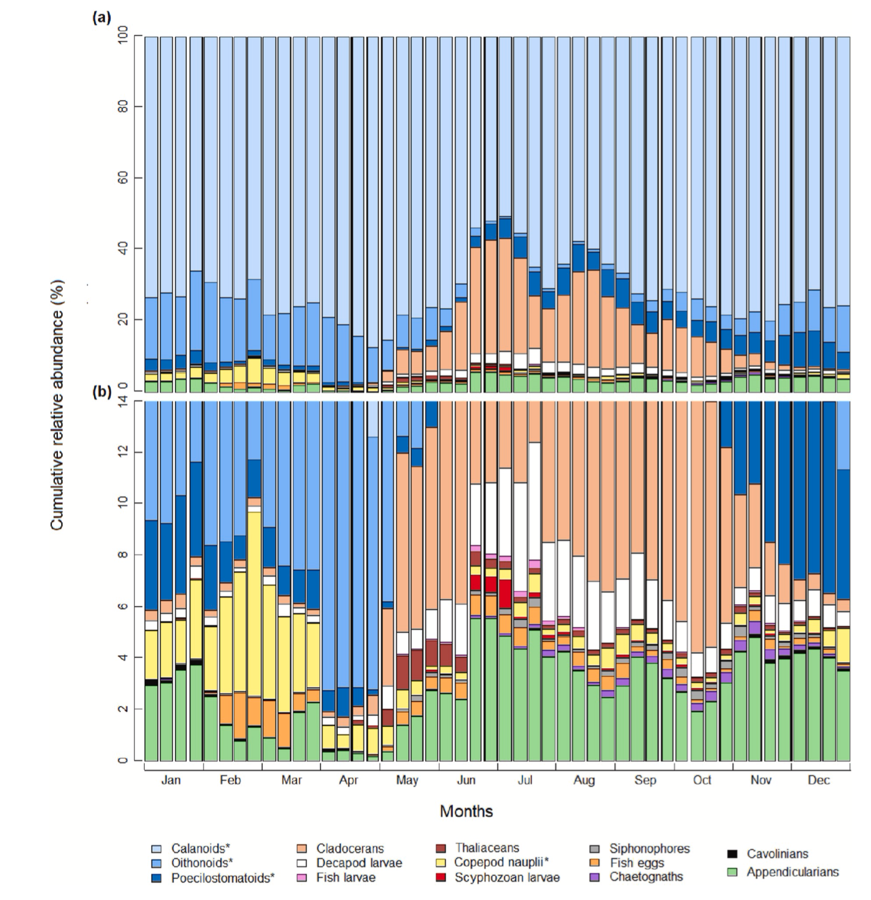
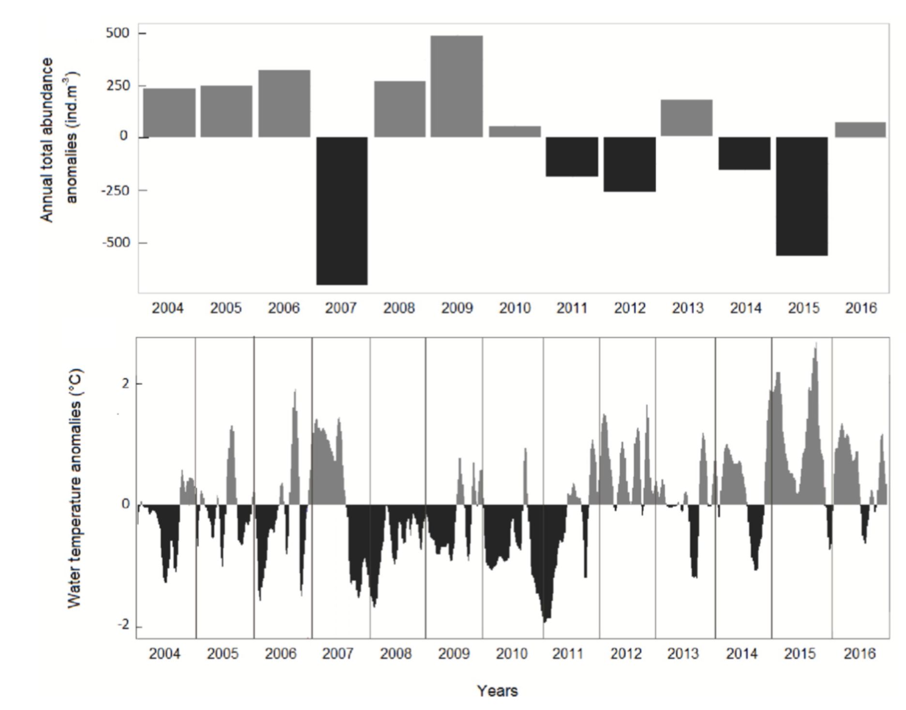
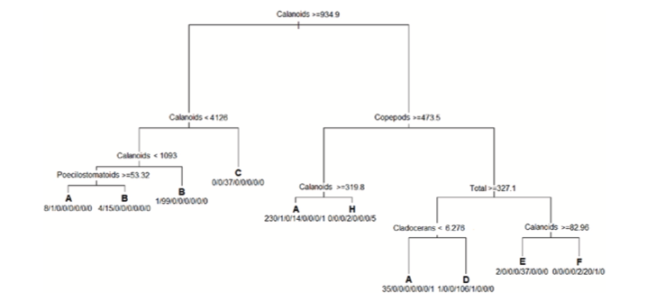
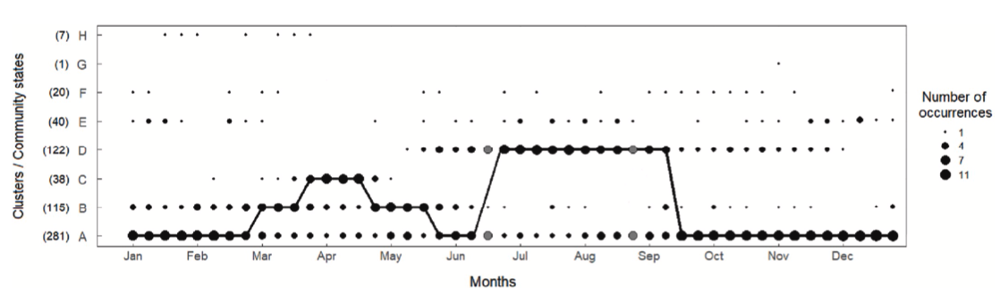
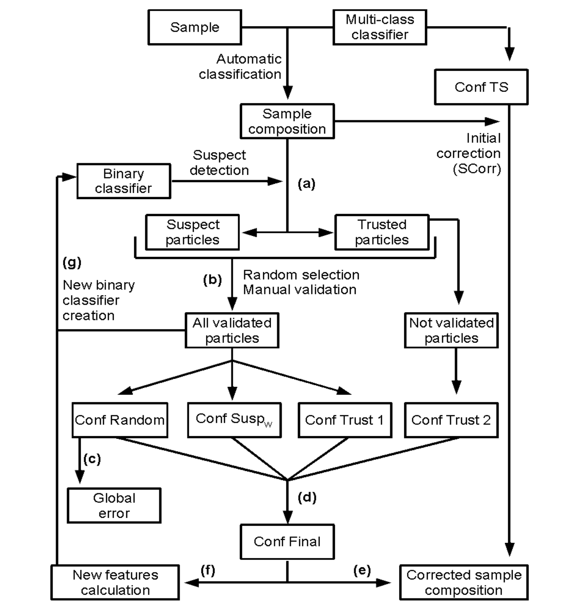
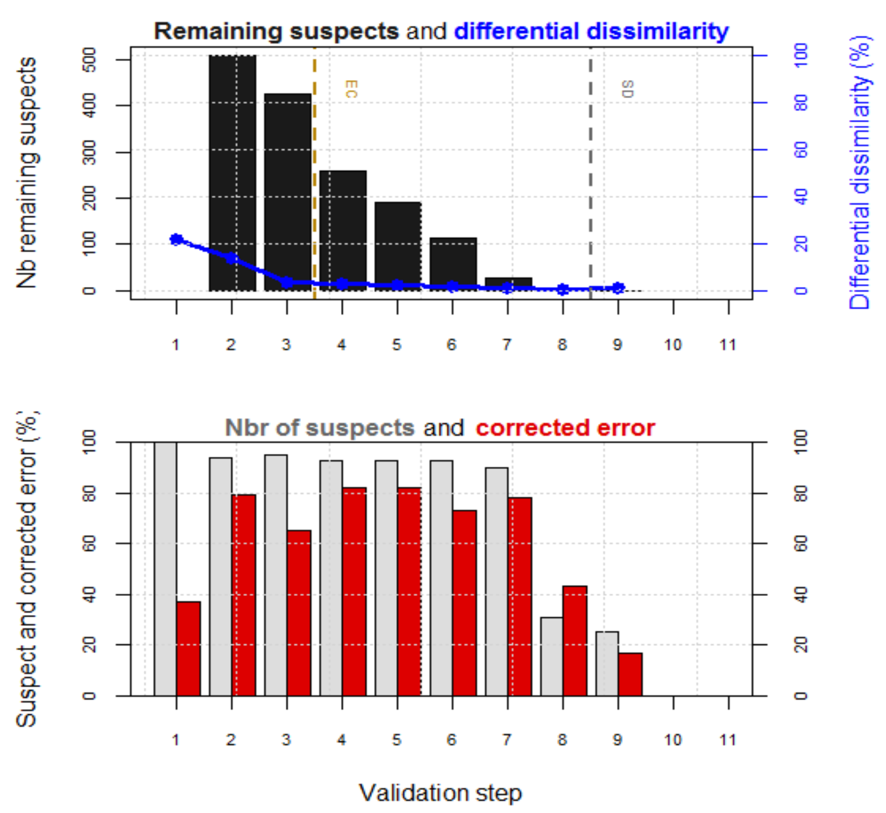

# Avancement de la recherche

## Titre provisoire de la thèse: 

Suivi de la dynamique du mésozooplancton en baie de Calvi (France) via la classification semi-automatisée d'images.

## Résumé : 

Le plancton est un élément majeur des écosystèmes marins. Le suivi de la dynamique du plancton est un enjeu capital. Ce suivi est un indicateur intéressant de la qualité du milieu. 

L'étape limitante actuelle dans ce suivi est l'analyse des échantillons prélevés. La classification automatique du plancton sur base d'image a permis de gagner en vitesse par rapport à une classification manuelle. Cependant de nombreuses questions reste en suspens sur la qualité de la classification. 

## Chapitre 1 : Suivi de la dynamique zooplanctonique en subsurface au cours du temps en baie de Calvi Corse

L'étude s'intéresse à la description de la communauté mésozooplanctonique dans la baie de Calvi entre 2004 et 2016. La communauté est répartie en 14 groupes pour cette étude. Les copépodes représentent la plus grande fraction des individus échantillonnés. 

Les anomalies de température de l'eau et les anomalies des abondances totales des individus sont corrélées. De fortes températures réduisent l'abondance du plancton. Les années 2007, 2012 et 2015 sont des années particulières.

L'originalité de cette étude est la définition de 8 stades qui permettent de résumer l'état global de la communauté planctonique. Ces stades sont obtenus par classification hiérarchique ascendante (CAH). Les règles qui définissent chaque stade sont ensuite obtenues par arbre de partitionnement.

Le nombre d'occurrence maximale des stades permet de définir un profil annuel type. 

Ce profil met en avant un changement particulier de la communauté en mars avec le pic de copépode suivi par un second changement de la communauté en juin avec le pic des cladocères.

**Avancement** : L'article de ce premier chapitre est publié [@Fullgrabe2020]. Ce premier chapitre est donc terminé

## Chapitre 2 : Comparaison entre les organismes planctoniques de subsurface et de profondeur en baie de Calvi Corse.

La méthode d'échantillonnage la plus utilisée est le trait de filet. Cette méthode est peu couteuse et simple de mise en œuvre. Elle permet d'avoir une estimation de l'abondance planctonique. 

On recense principalement 3 types de traits : les traits verticaux, les traits horizontaux et les traits obliques. Les traits verticaux sont les traits les plus utilisés car ils permettent d'intégrer la totalité de la colonne d'eau.

La station de recherche de Calvi réalisé des prélèvements via des traits de plancton horizontaux depuis 2003. Ils ont par la suite débuté des prélèvements verticaux depuis 2012. 

30 échantillons ont été sélectionnée afin de réaliser cette comparaison. 

Ce chapitre a pour objectif de permettre la comparaison avec les autres séries temporelles menées sur le plancton en Méditerranée (ajouter le nombre de série en cours  ...) dont l'échantillonnage est obtenu par traits verticaux.

**Avancement** : Deux mémoires ont été réalisé sur la comparaison de la communauté planctonique obtenue lors de traits de plancton horizontaux versus la communauté planctonique obtenue lors de traits de plancton verticaux. La compilation des données finales sont en cours de réalisation pour la rédaction d'une publication.

## Chapitre 3 : Correction des erreurs du à la classification automatique via la validation de suspects.

La classification automatique est très employée actuellement afin de classer rapidement des images de plancton. La classification se base sur un training set et d'algorithme qui vont utiliser ce set d'apprentissage afin de classer les items inconnues. Cette méthode seule comprend encore trop d'erreurs.

Différents outils ont été proposé afin d'améliorer la classification prédite par les algorithmes sur base du training set. La méthode la plus simple mais la plus longue est de réaliser une validation manuelle de chaque items. La classification automatique est employé comme un outil qui propose une classe uniquement. Elle requiert néanmoins d'avoir une expert en taxonomie qui valide en permanence les échantillons de plancton.

Une méthode de validation plus rapide est de déterminer des items suspects et de valider principalement ces items. Le schéma ci-dessous propose un schéma de la méthode.

On définit la composition d'un échantillon prélevé sur base d'outils de classifications automatiques. Les items peuvent être classé en items suspects ou en items de confiance (lors de la première détection, tous les items sont des suspects). Parmi les items à valider, il y aura un faible proportion d'items aléatoires, une large proportion d'items suspects et une faible proportion d'items de confiances. 

Ce processus est itératif. Les éléments validés sont employées pour améliorer la classification et la détection de nouveaux suspects à valider. Cette méthode permet donc de s'attarder principalement sur les items suspects d'un échantillon.

Le nombre de particule suspectes en fonction du nombre de validation est présenté sur la premier graphique. La hauteur des barres noires diminue progressivement à la suite des validations. La ligne bleue représente la différence entre les abondances corrigées obtenues après chaque étape avec l'étape précédente de validations. La ligne verticale nommé EC  indique e nombre de validation minimal afin d'avoir une dissimilarité des abondances inférieur à seuil par défaut de 5%. La ligne verticale nommé SD indique le nombre de validation à réaliser afin de valider tous les suspects de l'échantillon.

Le second graphique met en évidence la proportion de suspects et la proportion d'erreurs corrigées lors de chaque validation. Le nombre de suspects diminue au cours des validations.

La sélection des suspects est l'étape cruciale de la méthode afin de réduire le temps de validation de chaque échantillon. Les éléments fournis par la matrice de confusion, les classes rares ou encore les informations biologiques sont des éléments utilisés pour sélectionner les suspects. 

**Avancement** : 

Une publication est en cours d'écriture sur *Error correction of automatic classification of plankton digital images through partial validation of suspect items in Zoo/PhytoImage*.

Des tests vont débuter sur la correction d'erreur sur des échantillons de zooplancton de la baie de Calvi afin de compléter les résultats obtenus sur le phytoplancton.

Une technique originale, appelée fishing, permet d’augmenter le set d’apprentissage par rapport aux classes les plus rares. Cette technique sera incorporée dans le processus de validation des suspects et de correction d’erreur

## Chapitre 4 : ...

Lors du lancement d'une nouvelle étude qui nécessite la classification automatique d'organismes planctoniques, il faut réaliser un set d'apprentissage le plus rapidement possible afin de pouvoir débuter l'étude. On utilise principalement deux méthodes pour classer des images de plancton. 

La première méthode consiste à classer quelques images dans les différents groupes de notre set d'apprentissage. Une série d'attributs vont être calculés sur chaque image. Sur base du tableau des attributs et de la classe de chaque image, des algorithmes comme le Random Forest sont employé pour réaliser la classification de nouvelles images.

Une seconde méthode consiste à classer un très grand nombre d'images dans chaque catégorie et d'utiliser des outils de deep learning comme CNN (convolutional Neural Networks). 

Lors du lancement d'une étude, il n'est pas possible d'avoir une set d'apprentissage assez conséquent que pour employer le deep learning. Il existe des méthodes comme le transfer learning afin de pouvoir utiliser un set d'apprentissage plus restreint. Des algorithmes comme le RF sont déjà efficaces lorsque l'on a une 30 images par groupe.

Cette étude porte sur la réflexion d'un protocole associant, une classification manuelle au début, suivi de classification automatique avec un algorithme comme le Random Forest associé aux outils de correction d'erreurs (chapitre 3) afin de valider les images et enfin une transition sur des outils de Deep Learning.

**Avancement** : L'acquisition des données nécessaire à la réalisation de l'étude est terminée. La meilleure stratégie de transition entre le Machine Learning et le Deep Learning est en cours de réflexion.

# Données disponibles

Les données suivantes sont disponibles et vont être employées dans le cadre de cette étude. 

La série de Calvi comprend environs 900000 images provenant de 335 échantillons de traits horizontaux (entre 2004 et 2016) et 76 échantillons de traits verticaux (entre 2012 et 2016). Un set d'apprentissage de 11255 images classé en 22 groupes (dont 15 correspondant à du zooplankton) est associé à cette série.

Un jeu de données comprenant 57000 images a été collecté dans la baie de Tulear (Madagascar). Un set d'apprentissage de 25 groupes avec 1639 images a été réalisé.

Un set d'apprentissage issu du projet AMORE III financé par BelSpo comprend 3313 images réparti en 25 groupes.

Un set d'apprentissage global Manche-Atlantique 4X (Rephy/IFREMER) comprend 8508 images classées dans 59 groupes.

Le jeu de données provenant du challenge Kaggle *National Data Science Bowl Predict ocean health, one plankton at a time* de 2015 propose un set d'apprentissage de 30336 images réparti en 121 groupes.

Le ZooScanNet est un jeu donnée mondiale qui comprend 1433278 images réparti en 93 groupe. 

Le jeu de données WHOI comprend 6600 images avec un set d'apprentissage associé de 22 catégories avec 300 items par groupe. Ces images sont obtenue via le FlowCytobot.

# Activités valorisables pour la formation doctorale

L'ensemble des publications et communications scientifiques sont regroupés dans le fichier `publication_di_20201023.pdf`.

## Activités supplémentaires valorisables pour la formation doctorale

- 2020
  + 2h de séminaire : RBZS Workshop *Stress Management - keeping sane during your PhD* (8 décembre)
  + 2h de séminaire : RBZS Workshop *Present your Research with Impact* (1 décembre)
  + 4h (temps estimé) de formation sur OpenClassrooms :*Adoptez les API REST pour vos projets web*
  + 8h (temps estimé) de formation sur OpenClassrooms :*Réalisez des rapports statistiques clairs et impactants*
  + 8h (temps estimé) de formation sur OpenClassrooms :*Testez vos idées avec le lean prototyping*
  + 12h (temps estimé) de formation sur OpenClassrooms :*Initiez-vous à Python pour l'analyse de données*
  + 20h (temps estimé) de formation sur OpenClassrooms :*Initiez-vous à l'algèbre relationnelle avec le langage SQL*
  + 4h (temps estimé) de formation sur OpenClassrooms :*Mettez en place un système de veille informationnelle*
  + 12h (temps estimé) de formation sur OpenClassrooms :*Gérez votre temps efficacement*
  + 12h (temps estimé) de formation sur OpenClassrooms :*Initiez-vous à la statistique inférentielle*
  + 12h (temps estimé) de formation sur OpenClassrooms :*Initiez-vous au langage R pour analyser vos données*
  + 12h (temps estimé) de formation sur OpenClassrooms portant : *Utilisez Git et GitHub pour vos projets de développement*

- 2019
    + 1/2 journée de formation sur *Getting the most out of Git*
    + 1/2 journée de formation sur *R/exams: A One-For-All Exams Generator* lors useR 2019 à Toulouse
   
- 2018
    + Formation sur le deep learning. Formation d'1/2 journée sur le deep learning durant la septièmes rencontres R (Rennes, France) en 2018.
    
- 2017
    + C.I.B.I.M. (présence) Présence à le conférence annuelle du Centre Interuniversitaire de Biologie Marine à Louvain La Neuve 2017.

# Publications

